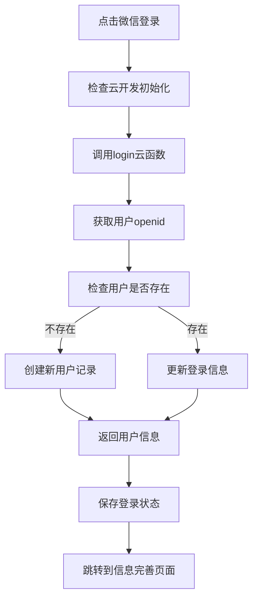

# 🔍 登录问题调试指南

## 快速诊断步骤

### 步骤 1：使用测试功能
1. 打开登录页面
2. 点击 **"测试云环境"** 按钮
3. 查看测试结果：

**✅ 成功情况**：
```
云环境测试结果
测试成功！
云函数响应：{
  "success": true,
  "message": "云开发环境测试成功！",
  "timestamp": "2024-01-01T12:00:00.000Z",
  "environment": "cloud1-3gdruqkn67e1cbe2",
  "openid": "xxx",
  "appid": "wx68a4d75dd80665ec"
}
```

**❌ 失败情况**：
- 错误码 -1：云函数不存在
- 错误码 -2：云函数运行错误  
- 错误码 -3：云开发环境不存在或无权限

### 步骤 2：检查云函数部署

在微信开发者工具中：
1. 展开 `cloudfunctions` 文件夹
2. 检查 `login` 文件夹是否有 ☁️ 云朵图标
3. 如果没有图标，右键 `login` 文件夹 → "上传并部署：云端安装依赖"

### 步骤 3：检查云开发设置

1. 打开微信开发者工具
2. 点击工具栏的"云开发"按钮
3. 确认环境ID是：`cloud1-3gdruqkn67e1cbe2`
4. 检查环境状态是否为"正常"

## 常见问题解决方案

### 🚫 问题1：云函数不存在 (errCode: -1)

**原因**：云函数未正确部署到云端

**解决方案**：
```bash
1. 在微信开发者工具中
2. 右键 cloudfunctions/login 文件夹
3. 选择 "上传并部署：云端安装依赖"
4. 等待部署完成（看到成功提示）
5. 重新测试登录
```

### 🚫 问题2：云函数运行错误 (errCode: -2)

**原因**：云函数代码有bug或依赖缺失

**解决方案**：
```bash
1. 打开云开发控制台
2. 查看云函数日志
3. 检查错误详情
4. 重新部署云函数
```

### 🚫 问题3：环境不存在 (errCode: -3)

**原因**：云开发环境配置错误

**解决方案**：
```bash
1. 检查 app.ts 中的环境ID配置
2. 确认云开发环境是否创建
3. 检查小程序是否开通云开发
```

## 详细调试方法

### 方法1：查看控制台日志

1. 在微信开发者工具中打开"调试器"
2. 切换到"Console"标签
3. 尝试登录，查看详细日志：
   ```javascript
   开始调用登录云函数...
   云函数调用结果: { result: {...}, errMsg: "..." }
   ```

### 方法2：查看云函数日志

1. 打开云开发控制台：https://console.cloud.tencent.com/tcb
2. 选择对应环境：cloud1-3gdruqkn67e1cbe2
3. 进入"云函数" → "日志"
4. 查看login函数的执行日志

### 方法3：检查网络连接

1. 确保设备网络正常
2. 尝试在真机上测试
3. 检查防火墙设置

## 常见错误对照表

| 错误信息 | 错误码 | 可能原因 | 解决方法 |
|---------|-------|---------|----------|
| 云函数不存在 | -1 | 未部署云函数 | 重新部署login云函数 |
| 云函数运行错误 | -2 | 代码错误/依赖缺失 | 检查云函数日志 |
| 环境不存在 | -3 | 环境ID错误 | 检查环境配置 |
| 网络连接失败 | - | 网络问题 | 检查网络连接 |
| 权限不足 | - | 权限配置错误 | 检查云开发权限 |

## 成功登录的完整流程



## 紧急解决方案

如果上述方法都无法解决，请尝试：

1. **重新创建云函数**：
   ```bash
   1. 删除 cloudfunctions/login 文件夹
   2. 重新创建并复制代码
   3. 重新部署
   ```

2. **重新初始化云开发**：
   ```bash
   1. 在云开发控制台创建新环境
   2. 更新app.ts中的环境ID
   3. 重新部署所有云函数
   ```

3. **检查小程序配置**：
   ```bash
   1. 确认AppID正确
   2. 确认云开发权限开启
   3. 确认基础库版本 ≥ 2.2.3
   ```

---

## 🆘 仍然无法解决？

请提供以下信息：
1. 测试云环境的具体错误信息
2. 控制台完整日志
3. 云函数日志截图
4. 云开发环境状态截图

这样可以更快速地定位和解决问题！
