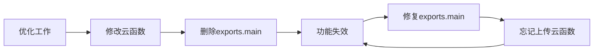

# 🚨 紧急修复指南

## 问题汇总

### 问题1：完成任务按钮无反应 ❌
- **现象**：点击"完成任务"按钮后没有任何反应
- **影响**：任务无法完成，无法流转到已完成状态
- **严重程度**：🔴 高危 - 核心功能完全失效

### 问题2：AI诊断页面真机显示异常 ❌  
- **现象**：真机环境缺少"选择批次"、"鹅只日龄"、"受影响数量"字段
- **影响**：无法正常使用AI诊断功能
- **严重程度**：🟡 中危 - 功能部分失效

---

## 🎯 根本原因分析

### 问题1根本原因：云函数未上传
```
本地代码 ✅ 已修复 → breeding-todo云函数添加了exports.main
云端代码 ❌ 旧版本 → 还是缺失exports.main的旧版本
结果：前端调用失败，显示"未知操作"
```

**关键代码修复位置**：
- 文件：`/cloudfunctions/breeding-todo/index.js`
- 第1109-1160行：已添加exports.main入口函数
- 第1030-1066行：已添加getUpcomingTodos函数
- 第1071-1104行：已添加getCompletedTodos函数

**云函数action支持列表**：
- ✅ getTodos（今日任务）
- ✅ getUpcomingTodos（即将到来）
- ✅ getCompletedTodos（已完成）
- ✅ completeTask（完成任务）
- ✅ cleanOrphanTasks（清理孤儿任务）

### 问题2根本原因：条件渲染依赖未满足
```wxml
<!-- 第233行：日龄显示依赖selectedBatchId -->
<view class="form-row day-age-row" wx:if="{{selectedBatchId}}">

<!-- 第242行：受影响数量依赖diagnosisType -->
<view class="form-row affected-count-row" wx:if="{{diagnosisType === 'live_diagnosis'}}">
```

**可能原因**：
1. loadBatchList执行失败
2. onBatchPickerChange没有正确触发
3. selectedBatchId没有正确设置

---

## ✅ 解决方案

### 方案1：上传云函数（最关键！）🔥

#### 步骤1：打开微信开发者工具
1. 启动微信开发者工具
2. 打开项目：`鹅数通`

#### 步骤2：上传breeding-todo云函数
1. 在左侧项目目录中，找到 `cloudfunctions/breeding-todo/`
2. **右键点击** `breeding-todo` 文件夹
3. 选择：**上传并部署：云端安装依赖**
4. 等待上传完成（约30秒-2分钟）

#### 步骤3：验证上传成功
在微信开发者工具控制台执行：
```javascript
wx.cloud.callFunction({
  name: 'breeding-todo',
  data: { action: 'getTodos', batchId: 'test', dayAge: 1 }
}).then(res => {
  console.log('✅ 云函数已部署:', res)
}).catch(err => {
  console.error('❌ 云函数调用失败:', err)
})
```

### 方案2：修复AI诊断页面（可选）

如果上传云函数后AI诊断页面仍然异常，执行以下修复：

#### 修复代码：增强loadBatchList容错性

**文件**：`/miniprogram/packageAI/ai-diagnosis/ai-diagnosis.ts`

**修改onLoad方法**（第128-146行）：
```typescript
onLoad(options: unknown) {
  const { recordId } = options || {}
  
  // 重置诊断状态（修复真机缓存问题）
  this.setData({
    diagnosisStatus: 'idle',
    diagnosisResult: null,
    diagnosisError: '',
    diagnosisId: '',
    showPolling: false,
    pollRetries: 0,
    sourceRecordId: recordId || '',
    // 🔧 新增：确保基础字段有默认值
    selectedBatchId: '',
    selectedBatchNumber: '',
    dayAge: 0,
    diagnosisType: 'live_diagnosis'
  })
  
  // 加载批次列表
  this.loadBatchList()
  
  this.validateForm()
}
```

---

## 🔍 测试检查清单

### 完成任务功能测试
- [ ] 点击任务详情弹窗中的"完成任务"按钮
- [ ] 确认任务状态变为"已完成"
- [ ] 确认任务从"进行中"标签消失
- [ ] 确认任务出现在"已完成"标签
- [ ] 确认没有报错提示

### AI诊断功能测试
- [ ] 打开AI智能诊断页面
- [ ] 确认"选择批次"字段正常显示
- [ ] 确认选择批次后"鹅只日龄"自动显示
- [ ] 确认"受影响数量"字段正常显示（病鹅诊断模式）
- [ ] 确认可以正常提交诊断
- [ ] 开发工具和真机显示一致

---

## 📊 问题追溯

### 为什么反复出现？



### 根本原因
1. ❌ 没有云函数单元测试
2. ❌ 本地修改后没有及时上传
3. ❌ 缺少云函数版本控制
4. ❌ 没有部署检查清单

---

## 🛡️ 永久预防措施

### 1. 建立云函数部署检查清单
创建 `DEPLOY-CHECKLIST.md`：
- [ ] 本地代码已测试
- [ ] 云函数已上传到云端
- [ ] 云端版本已验证
- [ ] 前端功能已测试
- [ ] 真机测试通过

### 2. 添加云函数版本标识
在每个云函数入口添加：
```javascript
const FUNCTION_VERSION = '1.0.0'
console.log(`breeding-todo v${FUNCTION_VERSION} 启动`)

exports.main = async (event, context) => {
  console.log(`breeding-todo v${FUNCTION_VERSION} - action: ${event.action}`)
  // ... 业务逻辑
}
```

### 3. 创建云函数测试脚本
`/scripts/test-cloud-functions.js`：
```javascript
const testCloudFunction = async () => {
  const actions = ['getTodos', 'getUpcomingTodos', 'getCompletedTodos', 'completeTask']
  
  for (const action of actions) {
    try {
      const res = await wx.cloud.callFunction({
        name: 'breeding-todo',
        data: { action, batchId: 'test', dayAge: 1 }
      })
      console.log(`✅ ${action}:`, res)
    } catch (err) {
      console.error(`❌ ${action}:`, err)
    }
  }
}
```

### 4. Git提交规范
在每次提交云函数修改时，提交信息必须包含：
```
fix: 修复breeding-todo云函数xxx问题

- 修改内容描述
- ⚠️ 需要上传云函数到云端！
```

---

## 📞 紧急联系

如果按照以上步骤仍然无法解决问题：

1. **检查云函数日志**
   - 进入微信云开发控制台
   - 查看breeding-todo云函数日志
   - 寻找报错信息

2. **重新部署云函数**
   - 删除云端breeding-todo云函数
   - 重新上传并部署

3. **回滚到上一个稳定版本**
   ```bash
   git log --oneline -10 -- cloudfunctions/breeding-todo/
   git checkout <commit-hash> -- cloudfunctions/breeding-todo/
   # 然后重新上传云函数
   ```

---

**最后更新**：2025-11-22 21:30  
**状态**：⚠️ 等待云函数上传  
**优先级**：🔴 P0 - 立即处理
