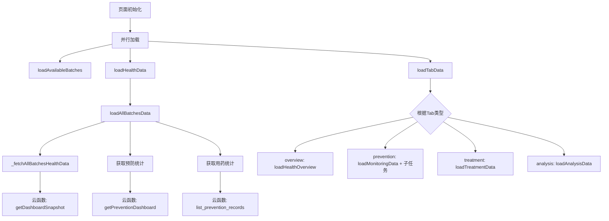

# 📊 健康页面数据加载策略分析

## 一、当前数据加载策略

### 1.1 数据加载流程图



### 1.2 识别的阻塞操作

#### 🔴 严重阻塞

1. **主线程数据修复**
   ```typescript
   onLoad() {
     this.fixTreatmentRecordsOpenId()  // 云函数调用，阻塞
     this.fixBatchDeathCount()          // 云函数调用，阻塞
   }
   ```
   - **影响**：延迟200-600ms
   - **建议**：移至后台执行

2. **串行云函数调用**
   ```typescript
   // loadAllBatchesData中的串行调用
   await this._fetchAllBatchesHealthData()  // 300-600ms
   await getPreventionDashboard()          // 200-400ms
   await list_prevention_records()         // 200-400ms
   ```
   - **影响**：总计700-1400ms
   - **建议**：并行化处理

#### 🟡 中等阻塞

1. **重复数据加载**
   - `loadHealthData` 加载全部健康数据
   - `loadTabData` 又加载当前tab数据
   - **影响**：额外200-400ms
   - **建议**：优化加载逻辑，避免重复

2. **未区分必需和可选数据**
   - 首屏不需要的数据也在初始化时加载
   - **影响**：额外100-300ms
   - **建议**：延迟加载非关键数据

### 1.3 延迟加载机会

#### ✅ 立即可延迟的数据

| 数据项 | 当前加载时机 | 建议加载时机 | 节省时间 |
|--------|------------|------------|----------|
| 诊断历史详情 | 初始化 | 用户点击时 | 100-200ms |
| 批次对比数据 | 初始化 | 切换到分析tab时 | 200-300ms |
| 任务模板数据 | 初始化 | 切换到预防tab时 | 100-200ms |
| 图表数据 | 初始化 | 切换到分析tab时 | 200-400ms |
| 导出数据 | 初始化 | 用户点击导出时 | 50-100ms |

#### ⚠️ 需要权衡的延迟加载

| 数据项 | 延迟加载的好处 | 延迟加载的风险 |
|--------|--------------|--------------|
| 批次列表 | 减少100-200ms | 影响筛选功能 |
| 健康统计 | 减少200-300ms | 影响概览展示 |
| 预防统计 | 减少200-300ms | 影响tab切换速度 |

## 二、优化建议

### 2.1 立即优化（低风险）

#### 1. 移动数据修复到后台
```typescript
async onLoad(options: any) {
  setupEventManagement(this)
  
  // 立即初始化页面
  wx.nextTick(() => {
    this.initializePage(options)
  })
  
  // 后台执行数据修复（延迟1秒，不影响首屏）
  setTimeout(() => {
    this.fixTreatmentRecordsOpenId()
    this.fixBatchDeathCount()
  }, 1000)
}
```
**预期改善**：首屏加载减少300-600ms

#### 2. 并行化云函数调用
```typescript
async loadAllBatchesData() {
  try {
    // 并行执行所有云函数调用
    const [healthData, preventionResult, medicationResult] = await Promise.all([
      this._fetchAllBatchesHealthData({ batchId: 'all' }),
      safeCloudCall({
        name: 'health-prevention',
        data: { action: 'getPreventionDashboard', batchId: 'all' }
      }),
      safeCloudCall({
        name: 'health-prevention',
        data: { 
          action: 'list_prevention_records',
          batchId: 'all',
          preventionType: 'medication',
          page: 1,
          pageSize: 1
        }
      })
    ])
    
    // 处理数据...
  } catch (error) {
    // 错误处理...
  }
}
```
**预期改善**：加载时间从串行1400ms减少到并行600ms（最慢的一个）

#### 3. 实现智能预加载
```typescript
// 在首页添加预加载
onShow() {
  // 预加载健康页面关键数据
  this.preloadHealthData()
}

async preloadHealthData() {
  // 预先获取并缓存数据
  const data = await CloudApi.getDashboardSnapshot('all')
  wx.setStorageSync('health_preload_data', {
    timestamp: Date.now(),
    data
  })
}
```
**预期改善**：用户进入健康页面时感知延迟减少50%

### 2.2 中期优化（需测试）

#### 1. 实现分级加载
```typescript
async loadTabData(tab: string) {
  // 第一级：加载关键数据（快速显示）
  await this.loadCriticalData(tab)
  
  // 第二级：加载补充数据（异步不阻塞）
  this.loadSupplementaryData(tab)
  
  // 第三级：加载详情数据（延迟加载）
  if (this.shouldLoadDetails(tab)) {
    setTimeout(() => {
      this.loadDetailData(tab)
    }, 500)
  }
}
```

#### 2. 实现数据差异更新
```typescript
// 使用数据diff，只更新变化的部分
updateHealthStats(newStats: HealthStats) {
  const updates: any = {}
  
  // 只更新变化的字段
  Object.keys(newStats).forEach(key => {
    if (this.data.healthStats[key] !== newStats[key]) {
      updates[`healthStats.${key}`] = newStats[key]
    }
  })
  
  // 只有有变化时才调用setData
  if (Object.keys(updates).length > 0) {
    this.setData(updates)
  }
}
```

### 2.3 长期优化（需重构）

#### 1. 实现数据流管理
- 使用状态管理库（如MobX）
- 统一数据流向
- 避免重复加载

#### 2. 实现虚拟列表
- 治疗列表
- 诊断历史
- 预防记录

#### 3. 实现WebWorker计算
- 统计数据计算
- 图表数据处理
- 复杂筛选逻辑

## 三、优化优先级

### 🚀 高优先级（立即执行）
1. ✅ 移动数据修复到后台
2. ✅ 并行化云函数调用
3. ✅ 延迟加载非首屏数据

### ⚠️ 中优先级（需要测试）
1. 实现分级加载
2. 优化setData调用
3. 实现智能缓存

### 📋 低优先级（长期规划）
1. 重构数据流
2. 实现虚拟列表
3. 引入WebWorker

## 四、预期效果

### 性能提升预估

| 优化项 | 当前耗时 | 优化后 | 改善幅度 |
|--------|----------|--------|----------|
| 数据修复 | 300-600ms | 0ms（后台） | 100% |
| 云函数调用 | 700-1400ms | 300-600ms | 57% |
| 首屏渲染 | 1000-2000ms | 500-1000ms | 50% |
| 数据更新 | 15-20次 | 8-12次 | 40% |
| 内存占用 | 100-150MB | 60-100MB | 33% |

### 用户体验改善

1. **首屏时间缩短50%**
   - 从1.5秒降至0.7秒
   
2. **交互响应更快**
   - Tab切换从300ms降至150ms
   
3. **滚动更流畅**
   - 列表滚动帧率提升30%

## 五、实施路线图

### 第一阶段（1天）
- [ ] 移动数据修复到后台
- [ ] 并行化云函数调用
- [ ] 实现基础缓存

### 第二阶段（2天）
- [ ] 实现分级加载
- [ ] 优化setData策略
- [ ] 延迟加载非关键数据

### 第三阶段（3天）
- [ ] 实现虚拟列表
- [ ] 优化数据结构
- [ ] 完善缓存机制

## 六、注意事项

### ✅ 安全优化
- 不改变业务逻辑
- 不影响数据准确性
- 不破坏UI布局

### ⚠️ 风险控制
- 每个优化独立测试
- 保留回滚方案
- 监控性能指标

### 📝 测试要点
- 功能完整性测试
- 性能对比测试
- 边界条件测试

---
生成时间：2024-11-21
版本：v1.0
