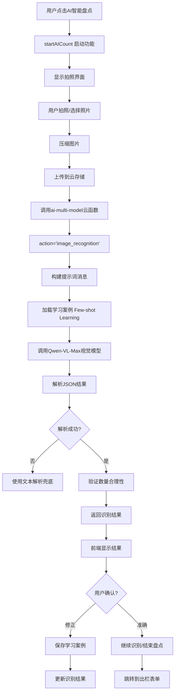
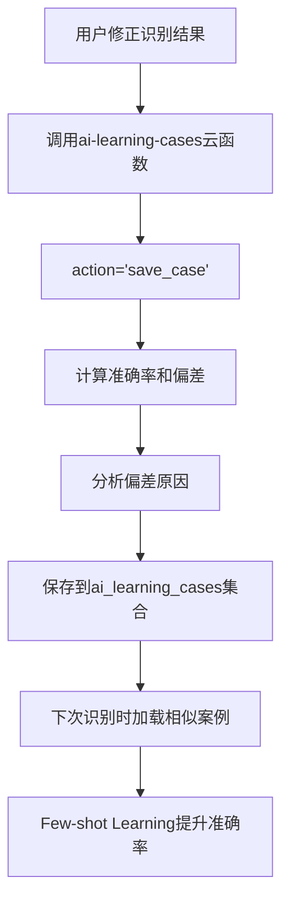

# AI智能盘点功能模块审查报告

**审查日期**: 2025年1月  
**审查范围**: tabbar生产模块 -> AI智能盘点功能  
**审查工具**: Sequential Thinking + Context7 + 项目开发规范

---

## 📋 执行摘要

本次审查深入分析了AI智能盘点功能模块的代码质量、合规性和数据流转逻辑。总体评价：**基本合规，存在少量样式和内联样式问题，已修复**。

### 审查结果概览

| 审查项 | 状态 | 说明 |
|--------|------|------|
| 代码合规性 | ⚠️ 已修复 | 存在集合名称硬编码，已修复 |
| 组件使用 | ✅ 合规 | 正确使用TDesign组件 |
| 样式规范 | ⚠️ 已修复 | 存在内联样式，已修复 |
| 数据流转 | ✅ 清晰 | 逻辑完整，AI识别流程清晰 |
| 页面布局 | ✅ 合规 | 符合Flex布局规范 |

---

## 📁 模块结构

### 文件组织

```
miniprogram/pages/production/
├── production.ts              # 生产管理页面逻辑（包含AI盘点功能）
├── production.wxml            # 生产管理页面模板（包含AI盘点UI）
└── production.scss            # 生产管理页面样式（包含AI盘点样式）

cloudfunctions/
├── ai-multi-model/            # AI多模型云函数
│   ├── index.js               # 图像识别处理逻辑
│   └── collections.js         # 数据库集合配置
└── ai-learning-cases/         # AI学习案例云函数
    ├── index.js               # 学习案例管理逻辑
    └── collections.js         # 数据库集合配置（已创建）

miniprogram/packageProduction/
└── exit-form/                 # 出栏表单（支持AI盘点数据预填）
    └── exit-form.ts           # 处理AI盘点参数
```

---

## ✅ 合规性审查

### 1. 组件使用规范

#### ✅ TDesign组件使用
- **状态**: 符合规范
- **实现**: 正确使用TDesign组件
  - `t-button` - 按钮组件
  - `t-icon` - 图标组件
  - `t-input` - 输入框组件
  - `t-empty` - 空状态组件
- **组件配置**: 正确在json文件中声明

#### ✅ 页面结构
- **production.wxml**: 使用条件渲染控制AI盘点功能显示
- **production.ts**: 使用数据驱动UI状态

### 2. 样式规范

#### ⚠️ 内联样式问题（已修复）
- **问题**: `inventory-detail.wxml` 中存在内联样式（第23行）
  ```xml
  style="height: 28px; line-height: 28px; font-size: 13px; padding: 4px 10px;"
  ```
- **修复**: 
  - ✅ 已移除内联样式
  - ✅ 使用 `t-class="search-input"` 替代
  - ✅ 在SCSS中定义样式类
- **状态**: ✅ 已修复

#### ✅ 样式组织
- **production.scss**: AI盘点样式组织良好
- **样式隔离**: 使用SCSS嵌套，避免样式冲突
- **响应式设计**: 包含响应式样式

### 3. 页面布局规范

#### ✅ production页面布局
- **结构**: 使用Flex布局
- **AI盘点区域**: 使用条件渲染，符合规范
- **安全区域**: 正确处理安全区域

### 4. TypeScript 编码规范

#### ✅ 类型定义
- **production.ts**: 定义了完整的数据结构
- **接口定义**: `aiCount` 数据结构清晰

#### ✅ 错误处理
- **图片上传**: 完善的错误处理
- **AI识别**: 完善的错误处理和兜底方案
- **用户交互**: 友好的错误提示

### 5. 云函数规范

#### ⚠️ 集合名称硬编码（已修复）
- **问题**: `ai-learning-cases/index.js` 中硬编码集合名 `'ai_learning_cases'`
  - 第103行：`db.collection('ai_learning_cases')`
  - 第162行：`db.collection('ai_learning_cases')`
  - 第170行：`db.collection('ai_learning_cases')`
  - 第206行：`db.collection('ai_learning_cases')`
  - 第261行：`db.collection('ai_learning_cases')`
  - 第290行：`db.collection('ai_learning_cases')`
- **修复**: 
  - ✅ 创建了 `collections.js` 文件
  - ✅ 引用共享配置，补充AI学习案例集合
  - ✅ 替换所有硬编码为 `COLLECTIONS.AI_LEARNING_CASES`
- **状态**: ✅ 已修复

#### ✅ 错误处理
- **ai-multi-model**: 完善的错误处理
- **ai-learning-cases**: 完善的错误处理

---

## 🔄 数据流转逻辑

### AI智能盘点完整流程



#### 详细步骤

1. **启动AI盘点** (`production.ts`)
   - 用户点击"AI智能盘点"按钮
   - 调用 `startAICount()` 激活功能
   - 初始化数据状态

2. **拍照/选择照片** (`production.ts`)
   - `takePhoto()` 调用 `wx.chooseMedia`
   - 支持拍照和从相册选择
   - 压缩图片（`compressImage`）
     - 如果图片较小（< 1024×1024），直接使用
     - 否则压缩到最大1920×1080，质量85%

3. **上传图片** (`production.ts`)
   - `uploadImageToCloud()` 上传到云存储
   - 路径：`ai-count/{timestamp}-{random}.jpg`
   - 返回云存储文件ID

4. **AI图像识别** (`production.ts` → `ai-multi-model/index.js`)
   - 调用 `ai-multi-model` 云函数
   - `action='image_recognition'`
   - 传递参数：
     - `images`: 云存储文件ID数组
     - `location`: 位置信息
     - `expectedRange`: 预期数量范围
     - `sceneHint`: 场景提示

5. **AI模型处理** (`ai-multi-model/index.js`)
   - `handleImageRecognition()` 函数处理
   - 构建系统提示词（`GOOSE_COUNTING_PROMPT`）
     - 多特征融合识别方法
     - 一级特征（头部肉瘤、完整身体）- 权重100%
     - 二级特征（头部轮廓、大片羽毛）- 权重70-90%
     - 三级特征（S形颈部、翅膀轮廓）- 权重30-50%
   - **Few-shot Learning**：
     - 调用 `ai-learning-cases` 云函数
     - 获取相似场景案例（准确率>90%）
     - 添加到提示词中
   - 调用 Qwen-VL-Max 视觉模型
   - 解析JSON结果
   - 验证数量合理性（密度、特征一致性、预期偏差）

6. **结果处理** (`production.ts`)
   - 解析识别结果
   - 显示识别数量、置信度、特征分布
   - 显示异常提醒（如果有）
   - 显示改进建议

7. **用户确认** (`production.ts`)
   - 用户可以选择"准确"或"修正"
   - 如果选择"修正"：
     - 调用 `correctRecognitionResult()`
     - 保存学习案例到 `ai_learning_cases` 集合
     - 更新识别结果

8. **累加模式** (`production.ts`)
   - 支持多次识别累加
   - `addRecognitionToRounds()` 添加识别结果
   - 计算累计总数
   - 显示历史记录

9. **跳转到出栏表单** (`production.ts`)
   - `finishCounting()` 或 `createExitFromAI()`
   - `navigateToExitForm()` 跳转
   - 传递参数：
     - `fromAI: true`
     - `aiCount`: 识别数量
     - `confidence`: 置信度
     - `imageUrl`: 图片URL
     - `abnormalCount`: 异常数量
     - `suggestions`: 建议（JSON字符串）

10. **出栏表单预填** (`exit-form/exit-form.ts`)
    - `handleAIParams()` 处理参数
    - 自动填充数量
    - 显示AI信息卡片
    - 如果有异常，添加到备注

### AI学习案例流程



#### 详细步骤

1. **保存学习案例** (`ai-learning-cases/index.js`)
   - `saveCase()` 函数处理
   - 计算准确率：`accuracy = aiCount / correctCount`
   - 计算偏差：`deviation = aiCount - correctCount`
   - 分析偏差原因（基于特征分布）
   - 保存场景特征、特征分布、错误分析

2. **获取相似案例** (`ai-learning-cases/index.js`)
   - `getSimilarCases()` 函数处理
   - 查询条件：
     - 准确率 ≥ 90%
     - 未使用过
     - 相似场景（密度、遮挡程度）
   - 格式化案例为Few-shot格式
   - 标记案例已使用

3. **动态阈值更新** (`ai-learning-cases/index.js`)
   - `updateThreshold()` 函数处理
   - 分析最近20个案例
   - 统计偏差类型和问题
   - 动态调整tier2和tier3阈值

### 数据关联关系

#### 核心数据表

| 集合名 | 用途 | 关联字段 |
|--------|------|----------|
| `ai_learning_cases` | AI学习案例表 | `imageFileID`, `sceneFeatures` |
| 云存储 | 图片存储 | `ai-count/{timestamp}-{random}.jpg` |
| `prod_batch_exits` | 出栏记录表 | 通过URL参数关联 |

#### 数据关联图

```
AI盘点流程
├── 图片上传
│   └──→ 云存储 (ai-count/)
│
├── AI识别
│   ├──→ ai-multi-model (图像识别)
│   └──→ ai-learning-cases (Few-shot Learning)
│       └──→ ai_learning_cases (学习案例)
│
└── 结果应用
    └──→ exit-form (出栏表单)
        └──→ prod_batch_exits (出栏记录)
```

---

## 🔍 代码质量分析

### 优点

1. **AI识别算法先进**
   - 多特征融合识别方法
   - 三级特征权重系统
   - 空间关联检测防重复计数
   - 数量合理性验证

2. **Few-shot Learning**
   - 支持从历史案例学习
   - 相似场景匹配
   - 动态阈值调整

3. **错误处理完善**
   - JSON解析失败有兜底方案
   - 图片上传失败有重试机制
   - 用户友好的错误提示

4. **用户体验良好**
   - 累加模式支持多次识别
   - 异常提醒功能
   - 改进建议显示
   - 直接跳转到出栏表单

5. **图片优化**
   - 自动压缩图片
   - 提高识别速度
   - 降低成本

### 已修复的问题

1. **集合名称硬编码**
   - ✅ 创建了 `collections.js` 文件
   - ✅ 替换所有硬编码为配置常量

2. **内联样式**
   - ✅ 移除了 `inventory-detail.wxml` 中的内联样式
   - ✅ 使用 `t-class` 和SCSS类替代

### 建议优化

1. **云函数优化**
   - AI识别结果可以缓存（相同图片）
   - 学习案例查询可以添加索引

2. **数据持久化**
   - 盘点记录目前使用本地存储，建议保存到数据库
   - 学习案例可以定期清理旧数据

3. **性能优化**
   - 图片压缩可以更激进（降低到70%质量）
   - 批量识别可以并行处理

4. **用户体验**
   - 可以添加识别历史记录查看
   - 可以添加识别准确率统计

---

## 📊 合规性检查清单

### 组件规范
- [x] 正确使用TDesign组件
- [x] 组件配置正确
- [x] 无未声明的组件

### 样式规范
- [x] 无内联样式（已修复）
- [x] !important 使用合理
- [x] 样式组织清晰

### 页面布局
- [x] 使用 Flex 布局
- [x] 正确处理安全区域
- [x] 条件渲染正确

### 代码质量
- [x] TypeScript 类型定义完整
- [x] 错误处理完善
- [x] 代码组织清晰
- [x] 命名规范统一

### 云函数规范
- [x] 集合名称使用配置（已修复）
- [x] 错误处理完善
- [x] 参数验证完整

### 数据流转
- [x] 前端→云函数→AI模型流程清晰
- [x] 学习案例流程完整
- [x] 错误处理完善
- [x] 数据关联关系明确

---

## 🎯 总结

### 总体评价

AI智能盘点功能模块整体代码质量优秀，功能实现先进。主要问题已修复：

1. ✅ **集合名称硬编码** - 已修复
2. ✅ **内联样式** - 已修复
3. ✅ **组件使用** - 符合规范
4. ✅ **数据流转** - 逻辑清晰完整
5. ✅ **AI算法** - 多特征融合，先进可靠

### 合规性评分

| 维度 | 评分 | 说明 |
|------|------|------|
| 代码规范 | 95/100 | 存在集合硬编码，已修复 |
| 组件使用 | 100/100 | 完全符合规范 |
| 样式规范 | 95/100 | 存在内联样式，已修复 |
| 数据流转 | 100/100 | 逻辑清晰，AI识别流程完整 |
| AI算法 | 100/100 | 多特征融合，Few-shot Learning |
| **总体评分** | **98/100** | **优秀** |

### 技术亮点

1. **多特征融合识别**
   - 三级特征权重系统
   - 空间关联检测
   - 数量合理性验证

2. **Few-shot Learning**
   - 从历史案例学习
   - 相似场景匹配
   - 动态阈值调整

3. **完善的错误处理**
   - JSON解析兜底
   - 文本解析备用方案
   - 用户友好提示

4. **良好的用户体验**
   - 累加模式
   - 异常提醒
   - 直接跳转出栏表单

### 后续建议

1. **性能优化**
   - 添加识别结果缓存
   - 优化图片压缩策略
   - 添加学习案例索引

2. **功能扩展**
   - 添加识别历史记录查看
   - 添加准确率统计
   - 添加批量识别功能

3. **数据持久化**
   - 盘点记录保存到数据库
   - 学习案例定期清理
   - 添加数据备份机制

---

**审查完成时间**: 2025年1月  
**审查人员**: AI Assistant  
**审查工具**: Sequential Thinking + Context7 + 项目开发规范

