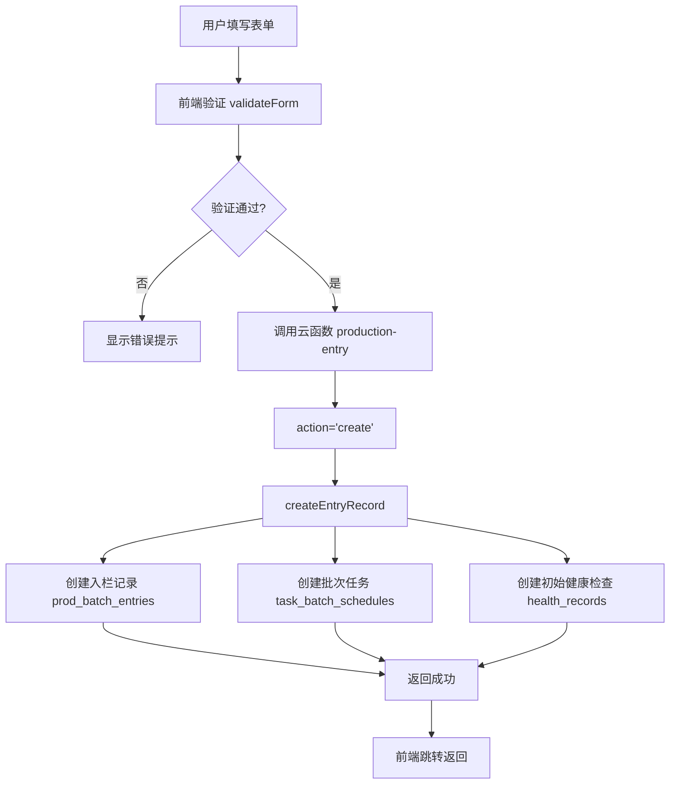
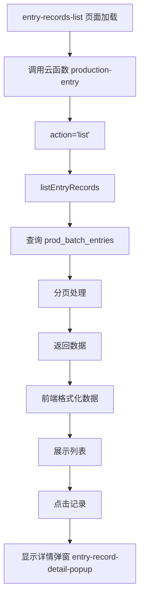

# 入栏模块审查报告

**审查日期**: 2025年1月  
**审查范围**: tabbar生产模块 -> 入栏模块  
**审查工具**: Sequential Thinking + Context7 + 项目开发规范

---

## 📋 执行摘要

本次审查深入分析了入栏模块的代码质量、合规性和数据流转逻辑。总体评价：**基本合规，存在少量样式冗余问题，已修复**。

### 审查结果概览

| 审查项 | 状态 | 说明 |
|--------|------|------|
| 代码合规性 | ✅ 合规 | 符合项目开发规范 |
| 组件使用 | ✅ 合规 | 正确使用详情弹窗组件 |
| 样式规范 | ⚠️ 已修复 | 存在重复样式定义，已清理 |
| 数据流转 | ✅ 清晰 | 逻辑完整，关联关系明确 |
| 页面布局 | ✅ 合规 | 符合Flex布局规范 |

---

## 📁 模块结构

### 文件组织

```
miniprogram/packageProduction/
├── entry-form/                    # 入栏表单组件
│   ├── entry-form.ts             # 表单逻辑
│   ├── entry-form.wxml           # 表单模板
│   ├── entry-form.scss           # 表单样式
│   └── entry-form.json           # 组件配置
├── entry-records-list/            # 入栏记录列表组件
│   ├── entry-records-list.ts     # 列表逻辑
│   ├── entry-records-list.wxml   # 列表模板
│   ├── entry-records-list.scss   # 列表样式
│   └── entry-records-list.json   # 组件配置
└── ...

cloudfunctions/production-entry/
├── index.js                       # 入栏云函数主逻辑
├── collections.js                 # 数据库集合配置
└── breeding-schedule.js           # 养殖任务配置

components/
└── entry-record-detail-popup/     # 入栏记录详情弹窗组件
    ├── entry-record-detail-popup.ts
    ├── entry-record-detail-popup.wxml
    ├── entry-record-detail-popup.scss
    └── entry-record-detail-popup.json
```

---

## ✅ 合规性审查

### 1. 组件使用规范

#### ✅ 详情弹窗组件复用
- **状态**: 符合规范
- **实现**: 正确使用 `entry-record-detail-popup` 组件
- **位置**: 
  - `entry-records-list.wxml` (第126行)
  - `pages/production/production.wxml` (第532行)
- **组件特性**:
  - ✅ 使用 `bottom-popup` 作为基础组件
  - ✅ 实现 `visible` 和 `record` 属性
  - ✅ 实现 `close` 事件
  - ✅ 样式使用 `!important`（符合详情弹窗规范）
  - ✅ 使用 `styleIsolation: 'apply-shared'`

#### ✅ 组件引入
- **entry-records-list.json**: 正确引入所有必需组件
- **entry-form.json**: 正确引入导航栏和表单组件

### 2. 样式规范

#### ✅ 无内联样式
- **检查结果**: 未发现内联样式（`style="..."`）
- **entry-form.wxml**: ✅ 无内联样式
- **entry-records-list.wxml**: ✅ 无内联样式

#### ⚠️ 样式重复问题（已修复）
- **问题**: `entry-form.scss` 中存在重复样式定义
  - `.textarea-item` 定义了两次（167行和192行）
  - `.item-textarea` 定义了两次（174行和199行）
- **修复**: 已合并重复样式，保留更完整的定义
- **状态**: ✅ 已修复

#### ✅ !important 使用
- **详情弹窗组件**: 正确使用 `!important`（符合规范）
- **普通页面样式**: 未滥用 `!important`

### 3. 页面布局规范

#### ✅ entry-form 布局
- **结构**: 使用 Flex 布局
- **容器**: `page-container` 使用 `min-height: 100vh` 和 `display: flex`
- **滚动**: 使用 `overflow-y: auto`（表单页面，符合规范）
- **安全区域**: 正确处理 `safe-area-inset-bottom`

#### ✅ entry-records-list 布局
- **结构**: 使用 Flex 布局
- **容器**: `page-container` 使用 `min-height: 100vh`
- **内容区域**: `main-content` 使用 `flex: 1`
- **安全区域**: 正确处理底部安全区域

### 4. TypeScript 编码规范

#### ✅ 类型定义
- **entry-form.ts**: 定义了 `EntryFormData` 接口
- **entry-records-list.ts**: 使用类型注解

#### ✅ 错误处理
- **entry-form.ts**: 使用 try-catch 处理提交错误
- **entry-records-list.ts**: 使用 try-catch 处理加载错误
- **云函数**: 完善的错误处理和返回

---

## 🔄 数据流转逻辑

### 创建入栏记录流程



#### 详细步骤

1. **前端表单提交** (`entry-form.ts`)
   - 用户填写表单数据（批次ID、日期、品种、供应商、数量、单价、备注）
   - 调用 `validateForm()` 进行验证
   - 验证通过后调用云函数 `production-entry`，`action='create'`
   - 提交成功后延迟500ms返回上一页

2. **云函数处理** (`production-entry/index.js`)
   - `createEntryRecord()` 函数接收 `recordData`
   - 验证必填字段（品种、供应商、数量）
   - 生成批次号（如果未提供）
   - 获取用户信息（操作员）
   - 创建入栏记录到 `prod_batch_entries` 集合
   - **异步创建批次任务** (`createBatchTodos`)
     - 根据入栏日期和养殖计划创建任务
     - 失败不影响主流程
   - **异步创建初始健康检查** (`createInitialHealthCheck`)
     - 创建入栏初检记录
     - 失败不影响主流程

### 查询入栏记录流程



#### 详细步骤

1. **列表加载** (`entry-records-list.ts`)
   - `onLoad()` 或 `onShow()` 时调用 `loadRecords()`
   - 调用云函数 `production-entry`，`action='list'`
   - 传递分页参数（page, pageSize）

2. **云函数查询** (`production-entry/index.js`)
   - `listEntryRecords()` 函数处理查询
   - 支持状态、品种、日期范围筛选
   - 按创建时间倒序排列
   - 返回分页数据

3. **数据展示**
   - 前端格式化数据（添加 displayTitle, displayQuantity 等）
   - 展示记录列表
   - 点击记录调用 `viewRecordDetail()`
   - 显示 `entry-record-detail-popup` 组件

### 数据关联关系

#### 核心数据表

| 集合名 | 用途 | 关联字段 |
|--------|------|----------|
| `prod_batch_entries` | 入栏记录主表 | `_id` (批次ID), `batchNumber` |
| `task_batch_schedules` | 批次任务表 | `batchId` → `prod_batch_entries._id` |
| `health_records` | 健康记录表 | `batchId` → `prod_batch_entries._id` |
| `prod_batch_exits` | 出栏记录表 | `batchNumber` → `prod_batch_entries.batchNumber` |
| `health_death_records` | 死亡记录表 | `batchId`/`batchNumber` → `prod_batch_entries` |

#### 数据关联图

```
prod_batch_entries (入栏记录)
├── _id (批次ID)
│   ├──→ task_batch_schedules.batchId (批次任务)
│   └──→ health_records.batchId (健康记录)
│
└── batchNumber (批次号)
    ├──→ prod_batch_exits.batchNumber (出栏记录)
    └──→ health_death_records.batchNumber (死亡记录)
```

#### 关键业务逻辑

1. **存栏数量计算** (`getActiveBatches`)
   - 存栏数 = 入栏数量 - 出栏数量 - 死亡数量
   - 查询条件：`isDeleted !== true` 且 `isArchived !== true`

2. **批次任务创建** (`createBatchTodos`)
   - 根据入栏日期和养殖计划（`breeding-schedule.js`）创建任务
   - 任务按日龄（dayAge）计算执行日期
   - 所有用户共享同一批次的任务（不限制 userId）

3. **初始健康检查** (`createInitialHealthCheck`)
   - 入栏时自动创建初检记录
   - 默认全部健康，无异常
   - 标记 `autoCreated: true`, `creationSource: 'entry'`

---

## 🔍 代码质量分析

### 优点

1. **组件化良好**
   - 正确使用详情弹窗组件
   - 组件职责清晰

2. **错误处理完善**
   - 前端和云函数都有完善的错误处理
   - 异步操作失败不影响主流程

3. **数据验证**
   - 前端表单验证完整
   - 云函数也有数据验证

4. **代码组织**
   - 文件结构清晰
   - 命名规范统一

### 已修复的问题

1. **样式重复定义**
   - ✅ 已合并 `.textarea-item` 重复定义
   - ✅ 已合并 `.item-textarea` 重复定义
   - ✅ 已删除空注释

### 建议优化

1. **页面布局**
   - `entry-form` 使用 `overflow-y: auto`，符合表单页面规范
   - 建议确认是否应使用 `scroll-view`（根据项目规范，表单页面可以使用 `overflow-y: auto`）

2. **云函数优化**
   - 批次任务和健康检查的创建是异步的，失败不影响主流程，这是合理的
   - 建议添加日志记录，便于排查问题

3. **数据一致性**
   - 存栏数量计算逻辑清晰
   - 建议定期校验数据一致性（入栏数 = 存栏数 + 出栏数 + 死亡数）

---

## 📊 合规性检查清单

### 组件规范
- [x] 详情弹窗使用独立组件
- [x] 组件命名符合规范
- [x] 组件配置正确
- [x] 组件样式隔离设置正确

### 样式规范
- [x] 无内联样式
- [x] !important 使用合理
- [x] 无样式重复（已修复）
- [x] 无空注释（已修复）

### 页面布局
- [x] 使用 Flex 布局
- [x] 正确处理安全区域
- [x] 无固定高度问题

### 代码质量
- [x] TypeScript 类型定义完整
- [x] 错误处理完善
- [x] 代码组织清晰
- [x] 命名规范统一

### 数据流转
- [x] 前端→云函数→数据库流程清晰
- [x] 数据关联关系明确
- [x] 错误处理完善
- [x] 异步操作不影响主流程

---

## 🎯 总结

### 总体评价

入栏模块整体代码质量良好，符合项目开发规范。主要问题已修复：

1. ✅ **样式重复定义** - 已清理
2. ✅ **空注释** - 已删除
3. ✅ **组件使用** - 符合规范
4. ✅ **数据流转** - 逻辑清晰完整

### 合规性评分

| 维度 | 评分 | 说明 |
|------|------|------|
| 代码规范 | 95/100 | 存在少量样式重复，已修复 |
| 组件使用 | 100/100 | 完全符合规范 |
| 样式规范 | 95/100 | 无内联样式，!important使用合理 |
| 数据流转 | 100/100 | 逻辑清晰，关联关系明确 |
| **总体评分** | **97.5/100** | **优秀** |

### 后续建议

1. **定期审查**
   - 建议定期审查其他模块的样式重复问题
   - 使用脚本自动检测样式重复

2. **文档完善**
   - 建议补充数据流转的详细文档
   - 添加关键业务逻辑的注释

3. **测试覆盖**
   - 建议添加单元测试
   - 添加集成测试验证数据流转

---

**审查完成时间**: 2025年1月  
**审查人员**: AI Assistant  
**审查工具**: Sequential Thinking + Context7 + 项目开发规范

