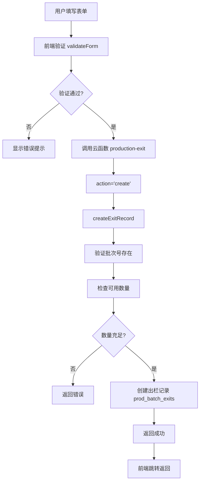
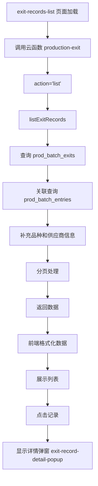
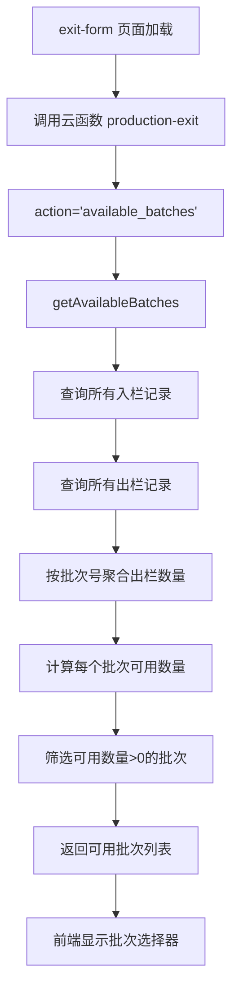

# 出栏模块审查报告

**审查日期**: 2025年1月  
**审查范围**: tabbar生产模块 -> 出栏模块  
**审查工具**: Sequential Thinking + Context7 + 项目开发规范

---

## 📋 执行摘要

本次审查深入分析了出栏模块的代码质量、合规性和数据流转逻辑。总体评价：**基本合规，存在少量样式冗余问题，已修复**。

### 审查结果概览

| 审查项 | 状态 | 说明 |
|--------|------|------|
| 代码合规性 | ✅ 合规 | 符合项目开发规范 |
| 组件使用 | ✅ 合规 | 正确使用详情弹窗组件 |
| 样式规范 | ⚠️ 已修复 | 存在重复样式定义，已清理 |
| 数据流转 | ✅ 清晰 | 逻辑完整，关联关系明确 |
| 页面布局 | ✅ 合规 | 符合Flex布局规范 |

---

## 📁 模块结构

### 文件组织

```
miniprogram/packageProduction/
├── exit-form/                      # 出栏表单组件
│   ├── exit-form.ts               # 表单逻辑
│   ├── exit-form.wxml             # 表单模板
│   ├── exit-form.scss             # 表单样式
│   └── exit-form.json             # 组件配置
├── exit-records-list/             # 出栏记录列表组件
│   ├── exit-records-list.ts       # 列表逻辑
│   ├── exit-records-list.wxml     # 列表模板
│   ├── exit-records-list.scss     # 列表样式
│   └── exit-records-list.json     # 组件配置
└── ...

cloudfunctions/production-exit/
├── index.js                        # 出栏云函数主逻辑
└── collections.js                  # 数据库集合配置（引用shared-config）

components/
└── exit-record-detail-popup/      # 出栏记录详情弹窗组件
    ├── exit-record-detail-popup.ts
    ├── exit-record-detail-popup.wxml
    ├── exit-record-detail-popup.scss
    └── exit-record-detail-popup.json
```

---

## ✅ 合规性审查

### 1. 组件使用规范

#### ✅ 详情弹窗组件复用
- **状态**: 符合规范
- **实现**: 正确使用 `exit-record-detail-popup` 组件
- **位置**: 
  - `exit-records-list.wxml` (第143行)
- **组件特性**:
  - ✅ 使用 `bottom-popup` 作为基础组件
  - ✅ 实现 `visible` 和 `record` 属性
  - ✅ 实现 `close` 事件
  - ✅ 样式使用 `!important`（符合详情弹窗规范）
  - ✅ 使用 `styleIsolation: 'apply-shared'`

#### ✅ 组件引入
- **exit-records-list.json**: 正确引入所有必需组件
- **exit-form.json**: 正确引入导航栏和表单组件

### 2. 样式规范

#### ✅ 无内联样式
- **检查结果**: 未发现内联样式（`style="..."`）
- **exit-form.wxml**: ✅ 无内联样式
- **exit-records-list.wxml**: ✅ 无内联样式

#### ⚠️ 样式重复问题（已修复）
- **问题**: `exit-form.scss` 中存在重复样式定义
  - `.textarea-item` 定义了两次（339行和364行）
  - `.item-textarea` 定义了两次（346行和371行）
- **修复**: 已合并重复样式，保留更完整的定义
- **状态**: ✅ 已修复

#### ✅ !important 使用
- **详情弹窗组件**: 正确使用 `!important`（符合规范）
- **普通页面样式**: 未滥用 `!important`

### 3. 页面布局规范

#### ✅ exit-form 布局
- **结构**: 使用 Flex 布局
- **容器**: `page-container` 使用 `min-height: 100vh` 和 `display: flex`
- **滚动**: 使用 `overflow-y: auto`（表单页面，符合规范）
- **安全区域**: 正确处理 `safe-area-inset-bottom`
- **特殊功能**: 支持AI盘点信息卡片显示

#### ✅ exit-records-list 布局
- **结构**: 使用 Flex 布局
- **容器**: `page-container` 使用 `min-height: 100vh`
- **内容区域**: `main-content` 使用 `flex: 1`
- **安全区域**: 正确处理底部安全区域

### 4. TypeScript 编码规范

#### ✅ 类型定义
- **exit-form.ts**: 定义了 `ExitFormData` 接口
- **exit-records-list.ts**: 使用类型注解

#### ✅ 错误处理
- **exit-form.ts**: 使用 try-catch 处理提交错误
- **exit-records-list.ts**: 使用 try-catch 处理加载错误
- **云函数**: 完善的错误处理和返回

---

## 🔄 数据流转逻辑

### 创建出栏记录流程



#### 详细步骤

1. **前端表单提交** (`exit-form.ts`)
   - 用户填写表单数据（批次ID、日期、客户、数量、平均重量/总重量、单价、备注）
   - 支持从AI盘点跳转，自动填充数量
   - 自动计算总重量和总收入
   - 调用 `validateForm()` 进行验证
   - 验证通过后调用云函数 `production-exit`，`action='create'`
   - 提交成功后延迟500ms返回上一页

2. **云函数处理** (`production-exit/index.js`)
   - `createExitRecord()` 函数接收 `recordData`
   - 验证必填字段（批次号、客户、数量）
   - 验证批次号是否存在（查询 `prod_batch_entries`）
   - 检查已出栏数量，计算可用数量
   - 验证出栏数量不超过可用数量
   - 生成出栏单号（格式：`X{YYMMDD}{随机3位}`）
   - 从入栏记录获取品种和供应商信息
   - 计算总收入（优先级：前端传递 > 总重量×单价 > 数量×平均重量×单价 > 数量×单价）
   - 创建出栏记录到 `prod_batch_exits` 集合

3. **特殊功能：AI盘点集成**
   - 支持从AI盘点页面跳转，传递盘点结果
   - 自动填充数量、置信度等信息
   - 显示AI盘点信息卡片
   - 异常提醒自动添加到备注

### 查询出栏记录流程



#### 详细步骤

1. **列表加载** (`exit-records-list.ts`)
   - `onLoad()` 或 `onShow()` 时调用 `loadRecords()`
   - 调用云函数 `production-exit`，`action='list'`
   - 传递分页参数（page, pageSize）

2. **云函数查询** (`production-exit/index.js`)
   - `listExitRecords()` 函数处理查询
   - 支持状态、客户、日期范围筛选
   - 按创建时间倒序排列
   - **关联查询入栏记录**：通过 `batchNumber` 关联 `prod_batch_entries`
   - 补充品种、供应商、入栏日期等信息
   - 兜底操作员信息（如果为空，从用户表查询）
   - 返回分页数据

3. **数据展示**
   - 前端格式化数据（添加 displayTitle, displayQuantity 等）
   - 展示记录列表（包含出栏号、客户、数量、重量等信息）
   - 点击记录调用 `viewRecordDetail()`
   - 显示 `exit-record-detail-popup` 组件

### 获取可用批次流程



#### 详细步骤

1. **前端加载批次** (`exit-form.ts`)
   - `onLoad()` 时调用 `loadAvailableBatches()`
   - 调用云函数 `production-exit`，`action='available_batches'`

2. **云函数计算** (`production-exit/index.js`)
   - `getAvailableBatches()` 函数处理
   - 查询所有入栏记录（`prod_batch_entries`）
   - 查询所有出栏记录（`prod_batch_exits`）
   - 按批次号聚合出栏数量
   - 计算每个批次的可用数量：`可用数量 = 入栏数量 - 已出栏数量`
   - 筛选可用数量 > 0 的批次
   - 按入栏日期排序
   - 返回批次列表（包含批次号、品种、可用数量等信息）

3. **前端展示**
   - 使用 `wx.showActionSheet` 显示批次选择器
   - 显示格式：`{批次号} ({品种} - 可出栏: {数量}羽)`
   - 选择批次后，限制数量输入不超过可用数量

### 数据关联关系

#### 核心数据表

| 集合名 | 用途 | 关联字段 |
|--------|------|----------|
| `prod_batch_exits` | 出栏记录主表 | `batchNumber`, `exitNumber` |
| `prod_batch_entries` | 入栏记录表 | `batchNumber` → `prod_batch_exits.batchNumber` |
| `wx_users` | 用户表 | `_openid` → `prod_batch_exits.userId` |

#### 数据关联图

```
prod_batch_exits (出栏记录)
├── batchNumber (批次号)
│   └──→ prod_batch_entries.batchNumber (入栏记录)
│       ├── breed (品种) - 关联获取
│       ├── supplier (供应商) - 关联获取
│       └── entryDate (入栏日期) - 关联获取
│
├── exitNumber (出栏单号) - 自动生成
│   └── 格式：X{YYMMDD}{随机3位}
│
└── userId (用户ID)
    └──→ wx_users._openid (用户信息)
        └── operator (操作员) - 关联获取
```

#### 关键业务逻辑

1. **可用数量计算** (`getAvailableBatches`)
   - 可用数量 = 入栏数量 - 已出栏数量
   - 查询条件：只查询状态为'已完成'的入栏记录
   - 按批次号聚合出栏数量

2. **数量验证** (`createExitRecord`)
   - 创建出栏记录时验证数量不超过可用数量
   - 更新出栏记录时也要验证数量
   - 排除当前记录本身计算可用数量

3. **总收入计算** (`createExitRecord`, `updateExitRecord`)
   - 优先级1：使用前端传递的 `totalRevenue`（如果 > 0）
   - 优先级2：总重量 × 单价（推荐方式）
   - 优先级3：数量 × 平均重量 × 单价
   - 优先级4：数量 × 单价（后备方案，不准确）

4. **总重量计算**
   - 如果前端传递了 `totalWeight`，直接使用
   - 否则计算：数量 × 平均重量

5. **数据关联补充** (`listExitRecords`)
   - 通过 `batchNumber` 关联查询入栏记录
   - 补充品种、供应商、入栏日期等信息
   - 如果操作员为空，从用户表查询并回写数据库

---

## 🔍 代码质量分析

### 优点

1. **组件化良好**
   - 正确使用详情弹窗组件
   - 组件职责清晰

2. **错误处理完善**
   - 前端和云函数都有完善的错误处理
   - 数量验证逻辑严谨

3. **数据验证**
   - 前端表单验证完整
   - 云函数也有数据验证
   - 数量验证考虑可用数量

4. **代码组织**
   - 文件结构清晰
   - 命名规范统一

5. **特殊功能**
   - 支持AI盘点集成
   - 自动计算总重量和总收入
   - 批次选择器显示可用数量

### 已修复的问题

1. **样式重复定义**
   - ✅ 已合并 `.textarea-item` 重复定义
   - ✅ 已合并 `.item-textarea` 重复定义
   - ✅ 已删除空注释

### 建议优化

1. **云函数优化**
   - `listExitRecords` 中关联查询入栏记录使用了 `Promise.all`，性能良好
   - 建议考虑添加缓存机制，减少重复查询

2. **数据一致性**
   - 出栏数量计算逻辑清晰
   - 建议定期校验数据一致性（入栏数 = 存栏数 + 出栏数 + 死亡数）

3. **AI盘点集成**
   - AI盘点功能集成良好
   - 建议添加AI盘点结果的持久化存储

---

## 📊 合规性检查清单

### 组件规范
- [x] 详情弹窗使用独立组件
- [x] 组件命名符合规范
- [x] 组件配置正确
- [x] 组件样式隔离设置正确

### 样式规范
- [x] 无内联样式
- [x] !important 使用合理
- [x] 无样式重复（已修复）
- [x] 无空注释（已修复）

### 页面布局
- [x] 使用 Flex 布局
- [x] 正确处理安全区域
- [x] 无固定高度问题

### 代码质量
- [x] TypeScript 类型定义完整
- [x] 错误处理完善
- [x] 代码组织清晰
- [x] 命名规范统一

### 数据流转
- [x] 前端→云函数→数据库流程清晰
- [x] 数据关联关系明确
- [x] 错误处理完善
- [x] 数量验证逻辑严谨

---

## 🎯 总结

### 总体评价

出栏模块整体代码质量良好，符合项目开发规范。主要问题已修复：

1. ✅ **样式重复定义** - 已清理
2. ✅ **空注释** - 已删除
3. ✅ **组件使用** - 符合规范
4. ✅ **数据流转** - 逻辑清晰完整
5. ✅ **特殊功能** - AI盘点集成良好

### 合规性评分

| 维度 | 评分 | 说明 |
|------|------|------|
| 代码规范 | 95/100 | 存在少量样式重复，已修复 |
| 组件使用 | 100/100 | 完全符合规范 |
| 样式规范 | 95/100 | 无内联样式，!important使用合理 |
| 数据流转 | 100/100 | 逻辑清晰，关联关系明确 |
| 特殊功能 | 100/100 | AI盘点集成良好 |
| **总体评分** | **98/100** | **优秀** |

### 与入栏模块对比

| 对比项 | 入栏模块 | 出栏模块 |
|--------|----------|----------|
| 样式重复问题 | ✅ 已修复 | ✅ 已修复 |
| 组件使用 | ✅ 合规 | ✅ 合规 |
| 数据流转 | ✅ 清晰 | ✅ 清晰 |
| 特殊功能 | 无 | ✅ AI盘点集成 |
| 数据关联 | 简单 | 复杂（关联入栏记录） |
| 数量验证 | 基础验证 | 严格验证（可用数量） |

### 后续建议

1. **定期审查**
   - 建议定期审查其他模块的样式重复问题
   - 使用脚本自动检测样式重复

2. **文档完善**
   - 建议补充数据流转的详细文档
   - 添加关键业务逻辑的注释
   - 补充AI盘点集成的使用说明

3. **测试覆盖**
   - 建议添加单元测试
   - 添加集成测试验证数据流转
   - 添加数量验证的边界测试

4. **性能优化**
   - 考虑为批次列表添加缓存
   - 优化关联查询的性能

---

**审查完成时间**: 2025年1月  
**审查人员**: AI Assistant  
**审查工具**: Sequential Thinking + Context7 + 项目开发规范

